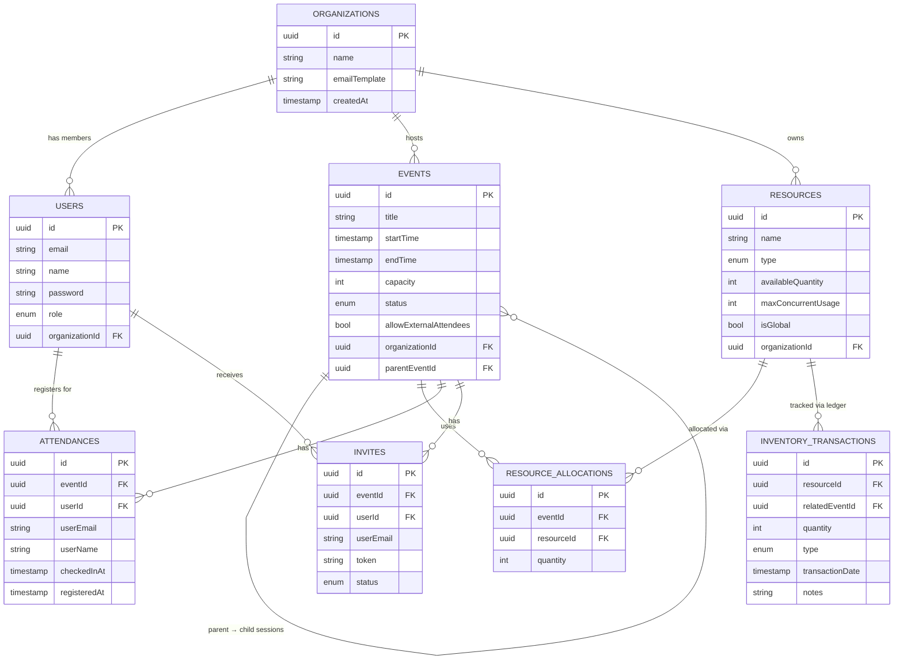

# Multi-Tenant Event Management System

[](https://www.typescriptlang.org/)
[](https://nestjs.com/)
[](https://reactjs.org/)
[](https://www.postgresql.org/)
[](LICENSE)

A full-stack multi-tenant event management platform. Organizations register, schedule events, manage resources and attendees, send invitations, and track analytics — all in isolated tenant spaces with role-based access control.

---

## Table of Contents

- [Architecture](#architecture)
- [Features](#features)
- [Tech Stack](#tech-stack)
- [Quick Start](#quick-start)
- [Configuration](#configuration)
- [Database](#database)
- [API Reference](#api-reference)
- [Business Rules](#business-rules)
- [Scripts](#scripts)
- [Contributing](#contributing)

---

## Architecture

### System Overview

```
┌──────────────────────────────────────────────────────────────────────┐
│                          Browser / Client                            │
│                                                                      │
│   ┌─────────────────────────────────────────────────────────────┐   │
│   │              React Frontend  (Vite 6 · :5173)               │   │
│   │                                                             │   │
│   │  ┌──────────┐  ┌──────────┐  ┌──────────┐  ┌───────────┐  │   │
│   │  │  Events  │  │Resources │  │Attendance│  │ Reports & │  │   │
│   │  │  & Orgs  │  │& Alloc.  │  │& Invites │  │ Analytics │  │   │
│   │  └──────────┘  └──────────┘  └──────────┘  └───────────┘  │   │
│   │                 AuthContext · Axios · React Router          │   │
│   └─────────────────────────────────────────────────────────────┘   │
│                      ↕  REST / JSON  (Bearer JWT)                    │
└──────────────────────────────────────────────────────────────────────┘
                                   │
                                   ▼
┌──────────────────────────────────────────────────────────────────────┐
│                    NestJS Backend API  (:3000)                       │
│                                                                      │
│  ┌──────────────────────────────────────────────────────────────┐   │
│  │                    Global Guards & Pipes                     │   │
│  │         JwtAuthGuard · RolesGuard · ValidationPipe          │   │
│  └──────────────────────────────────────────────────────────────┘   │
│                                                                      │
│  ┌──────┐ ┌──────┐ ┌────────┐ ┌──────────┐ ┌────────┐ ┌───────┐   │
│  │ Auth │ │Events│ │  Orgs  │ │Resources │ │Invites │ │Reports│   │
│  │      │ │      │ │ Users  │ │Alloc.    │ │Attend. │ │       │   │
│  └──────┘ └──────┘ └────────┘ └──────────┘ └────────┘ └───────┘   │
│                                                                      │
│  ┌───────────────────────┐   ┌─────────────────────────────────┐   │
│  │   Inventory Service   │   │        Mailer Service           │   │
│  │  (ledger · balance)   │   │     (Nodemailer · SMTP)         │   │
│  └───────────────────────┘   └─────────────────────────────────┘   │
│                              TypeORM 0.3                            │
└──────────────────────────────────────────────────────────────────────┘
                                   │
                                   ▼
┌──────────────────────────────────────────────────────────────────────┐
│                    PostgreSQL 12+  (event_booking)                   │
│                                                                      │
│  organizations  users  events  resources  resource_allocations       │
│  attendances  invites  inventory_transactions  migrations            │
│                                                                      │
│  ┌────────────────────────────────────────────────────────────┐     │
│  │      Materialized View: resource_utilization_summary       │     │
│  │   (Recursive CTEs · Window Functions · Composite Indexes)  │     │
│  └────────────────────────────────────────────────────────────┘     │
└──────────────────────────────────────────────────────────────────────┘
```

### Data Model



### Authentication Flow

```
Client                          NestJS                       PostgreSQL
  │                               │                               │
  │──POST /auth/login ──────────► │                               │
  │                               │── SELECT user by email ──────►│
  │                               │◄─ user row ───────────────────│
  │                               │   bcrypt.compare(password)    │
  │◄── { access_token: JWT } ─────│                               │
  │                               │                               │
  │──GET /events ────────────────►│                               │
  │  Authorization: Bearer <JWT>  │                               │
  │                               │   JwtAuthGuard.canActivate()  │
  │                               │   RolesGuard.canActivate()    │
  │                               │── SELECT * FROM events ──────►│
  │◄── JSON response ─────────────│◄─ rows ───────────────────────│
```

---

## Features

| Area | Capabilities |
|------|-------------|
| **Multi-Tenancy** | Isolated organization spaces · domain-based user assignment · global shared resources |
| **Events** | CRUD with draft/published/cancelled states · parent-child session hierarchy · past-event protection |
| **Resources** | Exclusive (no overlap) · Shareable (concurrent usage limit) · Consumable (ledger-based inventory) |
| **Attendance** | User & external (email-only) registration · check-in timestamps · capacity enforcement · 15-min deregistration window |
| **Invitations** | User & external invites · public token links · email notifications · pending/accepted/declined/cancelled states |
| **Inventory** | Transaction ledger (RESTOCK / ALLOCATION / RETURN / ADJUSTMENT) · projected balance · shortage detection |
| **Reports** | Double-booked users · resource constraint violations · utilization analytics · parent-child violations · external attendee thresholds · show-up rate |
| **Security** | JWT authentication · bcrypt passwords · role-based guards (Admin / Org Admin / User) · parameterized queries |

---

## Tech Stack

| Layer | Technology | Version |
|-------|-----------|---------|
| Frontend Framework | React | 18.2 |
| Frontend Build | Vite | 6.4 |
| Frontend Routing | React Router DOM | 6.15 |
| HTTP Client | Axios | 1.5 |
| Charts | Recharts | 3.6 |
| Notifications | react-hot-toast | 2.6 |
| Backend Framework | NestJS | 10.0 |
| Language | TypeScript | 5.1 |
| ORM | TypeORM | 0.3 |
| Database | PostgreSQL | 12+ |
| Authentication | Passport + JWT | — |
| Validation | class-validator | 0.14 |
| Email | Nodemailer | 7.x |

---

## Quick Start

### Prerequisites

- Node.js ≥ 18
- PostgreSQL ≥ 12
- npm

### 1. Clone

```bash
git clone <repository-url>
cd EventManagementSystem
```

### 2. Database

```bash
psql -U postgres -c "CREATE DATABASE event_booking;"
```

### 3. Backend

```bash
cd backend
npm install
# .env is already present with local defaults (see Configuration)
npm run migration:run
npm run start:dev        # http://localhost:3000
```

### 4. Seed demo data

```bash
node seed-demo.js        # creates 3 orgs, 13 users, events, resources, allocations
node seed-consumable-violation.js  # adds CONSUMABLE_EXCEEDED report data (optional)
```

To populate all analytics reports:

```bash
bash seed-analytics.sh
```

### 5. Frontend

```bash
cd ../frontend
npm install
npm run dev              # http://localhost:5173
```

### Demo credentials

| Role | Email | Password |
|------|-------|----------|
| Org Admin — TechCorp | `alice@techcorp.com` | `Test@1234` |
| Org Admin — MedHealth | `bob@medhealth.com` | `Test@1234` |
| Org Admin — EduLearn | `carol@edulearn.com` | `Test@1234` |
| User — TechCorp | `dave@techcorp.com` | `Test@1234` |
| Independent User | `morgan@personal.com` | `Test@1234` |

> To create a Super Admin: `cd backend && npm run add-admin`

---

## Configuration

### Backend (`backend/.env`)

| Variable | Description | Default |
|----------|-------------|---------|
| `DB_HOST` | PostgreSQL host | `localhost` |
| `DB_PORT` | PostgreSQL port | `5432` |
| `DB_USERNAME` | Database user | `postgres` |
| `DB_PASSWORD` | Database password | `postgres` |
| `DB_DATABASE` | Database name | `event_booking` |
| `PORT` | API server port | `3000` |
| `JWT_SECRET` | JWT signing secret | **required** |
| `SMTP_HOST` | SMTP server host | `localhost` |
| `SMTP_PORT` | SMTP port | `1025` |
| `SMTP_USER` | SMTP username | — |
| `SMTP_PASS` | SMTP password | — |
| `SMTP_FROM` | Sender address | `EventBook <noreply@eventbook.local>` |

Email sending is optional — invites work without it (tokens are still created).

---

## Database

### Migrations

```bash
cd backend

npm run migration:run        # apply all pending migrations
npm run migration:revert     # roll back the last migration
npm run migration:generate   # scaffold a new migration from entity changes
```

Migrations live in `backend/src/migrations/`. The schema uses:

- **Recursive CTEs** — parent-child event hierarchy traversal
- **Window functions** — consumable inventory running balances
- **Materialized view** — `resource_utilization_summary` (refresh via `POST /reports/refresh-utilization-view`)
- **Composite unique constraints** — prevent duplicate attendance/invite records
- **Cascading deletes** — consistent cleanup across related tables

### Schema Summary

```
organizations
  └── users (organizationId)
  └── events (organizationId)
        └── events (parentEventId — self-referential)
        └── resource_allocations (eventId)
        └── attendances (eventId)
        └── invites (eventId)
  └── resources (organizationId, nullable = global)
        └── resource_allocations (resourceId)
        └── inventory_transactions (resourceId)
```

---

## API Reference

All endpoints (except `/auth/login` and `/public/invites/*`) require:

```
Authorization: Bearer <JWT>
```

### Auth

| Method | Endpoint | Description | Auth |
|--------|----------|-------------|------|
| POST | `/auth/login` | Obtain JWT | Public |

### Organizations

| Method | Endpoint | Description | Roles |
|--------|----------|-------------|-------|
| GET | `/organizations` | List all | Admin |
| POST | `/organizations` | Create | Admin |
| GET | `/organizations/:id` | Get one | Admin |
| PATCH | `/organizations/:id` | Update | Admin |
| DELETE | `/organizations/:id` | Delete | Admin |

### Users

| Method | Endpoint | Description | Roles |
|--------|----------|-------------|-------|
| GET | `/users?organizationId=` | List | Admin, Org Admin |
| POST | `/users` | Create | Admin, Org Admin |
| GET | `/users/:id` | Get one | Admin, Org Admin |
| PATCH | `/users/:id` | Update | Admin, Org Admin |
| DELETE | `/users/:id` | Delete | Admin, Org Admin |

### Events

| Method | Endpoint | Description | Roles |
|--------|----------|-------------|-------|
| GET | `/events?organizationId=` | List | All |
| POST | `/events` | Create | Admin, Org Admin |
| GET | `/events/:id` | Get one | All |
| PATCH | `/events/:id` | Update | Admin, Org Admin¹ |
| DELETE | `/events/:id` | Delete | Admin, Org Admin¹ |

¹ Org Admins cannot modify past events.

### Resources

| Method | Endpoint | Description | Roles |
|--------|----------|-------------|-------|
| GET | `/resources?organizationId=&isGlobal=` | List | All |
| POST | `/resources` | Create | Admin, Org Admin |
| GET | `/resources/:id` | Get one | All |
| GET | `/resources/:id/availability` | Check time availability | All |
| PATCH | `/resources/:id` | Update | Admin, Org Admin |
| DELETE | `/resources/:id` | Delete | Admin, Org Admin |

### Resource Allocations

| Method | Endpoint | Description | Roles |
|--------|----------|-------------|-------|
| GET | `/allocations?eventId=&resourceId=` | List | Admin, Org Admin |
| POST | `/allocations` | Allocate resource to event | Admin, Org Admin |
| PATCH | `/allocations/:id` | Update quantity | Admin, Org Admin¹ |
| DELETE | `/allocations/:id` | Remove | Admin, Org Admin¹ |

¹ Cannot modify allocations for past events.

### Attendances

| Method | Endpoint | Description | Roles |
|--------|----------|-------------|-------|
| GET | `/attendances?eventId=` | List | All |
| POST | `/attendances` | Register (user or external) | All |
| POST | `/attendances/:id/checkin` | Record check-in | All |
| DELETE | `/attendances/:id` | Remove registration | All |

### Invitations

| Method | Endpoint | Description | Roles |
|--------|----------|-------------|-------|
| GET | `/invites` | List | All |
| GET | `/invites/my-invites` | My pending invites | All |
| POST | `/invites` | Send invite | Admin, Org Admin |
| PATCH | `/invites/:id` | Update status | Admin, Org Admin |
| DELETE | `/invites/:id` | Cancel | Admin, Org Admin |
| POST | `/invites/:id/accept` | Accept | All |
| POST | `/invites/:id/decline` | Decline | All |
| GET | `/public/invites/:token` | Resolve public token | Public |
| POST | `/public/invites/:token/accept` | Accept via token | Public |
| POST | `/public/invites/:token/decline` | Decline via token | Public |

### Inventory

| Method | Endpoint | Description | Roles |
|--------|----------|-------------|-------|
| GET | `/inventory/balance/:resourceId` | Current stock balance | Admin, Org Admin |
| GET | `/inventory/projected-balance/:resourceId?date=` | Balance at a future date | Admin, Org Admin |
| GET | `/inventory/history/:resourceId?startDate=&endDate=` | Transaction history | Admin, Org Admin |
| GET | `/inventory/running-balance/:resourceId` | Balance over time (chart data) | Admin, Org Admin |
| GET | `/inventory/shortages?resourceId=` | Detect stock shortages | Admin, Org Admin |
| POST | `/inventory/restock` | Add stock | Admin, Org Admin |

### Reports

| Method | Endpoint | Description | Roles |
|--------|----------|-------------|-------|
| GET | `/reports/double-booked-users` | Users in overlapping events | Admin, Org Admin |
| GET | `/reports/violated-constraints` | Resource rule violations | Admin, Org Admin |
| GET | `/reports/resource-utilization?organizationId=` | Hours used, peak usage, utilization % | Admin, Org Admin |
| GET | `/reports/parent-child-violations` | Child events outside parent bounds | Admin, Org Admin |
| GET | `/reports/external-attendees?threshold=10` | Events exceeding external attendee threshold | Admin, Org Admin |
| GET | `/reports/show-up-rate` | Check-in vs. registration rates | Admin, Org Admin |
| GET | `/reports/capacity-utilization` | Attendance vs. event capacity | Admin, Org Admin |
| POST | `/reports/refresh-utilization-view` | Rebuild materialized view | Admin, Org Admin |

---

## Business Rules

### Events

- End time must be after start time.
- Child sessions must fall entirely within their parent event's time window. The parent's time range must fully contain all children.
- Org Admins cannot create, edit, or delete past events.
- Event capacity cannot be exceeded by registrations.

### Resources

| Type | Rule |
|------|------|
| **Exclusive** | Only one event may hold the resource at any given time — no overlapping allocations. |
| **Shareable** | Total concurrent usage across overlapping events cannot exceed `maxConcurrentUsage`. |
| **Consumable** | Allocations draw from an inventory ledger. The projected balance at the event's start time cannot go negative. Stock is managed via RESTOCK / ALLOCATION / RETURN / ADJUSTMENT transactions. |

### Attendance

- A registration must supply either `userId` (registered user) **or** `userEmail` (external), not both.
- External attendees are only permitted if `event.allowExternalAttendees = true`.
- The same user cannot be registered for two overlapping events simultaneously.
- Deregistration is permitted up to 15 minutes after the event starts.

### Invitations

- Cannot invite to events with status `draft` or `cancelled`.
- Cannot send external invites unless `event.allowExternalAttendees = true`.
- Invite statuses: `pending` → `accepted` / `declined` / `cancelled`.

---

## Scripts

### Backend (`cd backend`)

```bash
npm run start:dev          # development server with watch mode
npm run start:prod         # production server (requires build)
npm run build              # compile TypeScript → dist/

npm run migration:run      # apply all pending migrations
npm run migration:revert   # roll back last migration
npm run migration:generate # generate migration from entity diff

npm run seed               # seed organisations, users, events, resources
npm run add-admin          # interactive prompt to create a Super Admin

npm test                   # unit tests
npm run test:cov           # unit tests with coverage report
npm run test:e2e           # end-to-end tests
npm run lint               # ESLint
npm run format             # Prettier
```

### Frontend (`cd frontend`)

```bash
npm run dev       # Vite dev server  →  http://localhost:5173
npm run build     # production build →  dist/
npm run preview   # preview production build locally
npm run lint      # ESLint
```

### Seed utilities (backend root)

```bash
node seed-demo.js                  # full demo dataset (3 orgs, 13 users, events, resources)
bash seed-analytics.sh             # adds external attendees + hierarchy violations + refreshes view
node seed-consumable-violation.js  # adds CONSUMABLE_EXCEEDED report data
```

---

## Project Structure

```
EventManagementSystem/
├── backend/
│   ├── src/
│   │   ├── auth/                   # JWT strategy, guards, decorators
│   │   ├── entities/               # TypeORM entity definitions
│   │   ├── migrations/             # versioned schema migrations
│   │   ├── organizations/          # org CRUD module
│   │   ├── users/                  # user CRUD module
│   │   ├── events/                 # event CRUD + validation module
│   │   ├── resources/              # resource CRUD + availability module
│   │   ├── allocations/            # resource-to-event allocation module
│   │   ├── attendances/            # attendance + check-in module
│   │   ├── invites/                # invitation module
│   │   ├── inventory/              # inventory ledger module
│   │   ├── reports/                # analytics queries module
│   │   ├── services/
│   │   │   └── inventory.service.ts  # shared inventory ledger logic
│   │   ├── app.module.ts
│   │   └── main.ts
│   ├── seed-demo.js                # comprehensive demo seed (raw SQL via pg)
│   ├── seed-consumable-violation.js
│   ├── seed-analytics.sh
│   ├── .env                        # local environment variables
│   └── package.json
│
├── frontend/
│   ├── src/
│   │   ├── components/
│   │   │   ├── EventsList.tsx
│   │   │   ├── EventForm.tsx
│   │   │   ├── ResourcesList.tsx
│   │   │   ├── ResourceAllocation.tsx
│   │   │   ├── ResourceAvailabilityViewer.tsx
│   │   │   ├── AttendeesList.tsx
│   │   │   ├── InvitesManagement.tsx
│   │   │   ├── MyAttendance.tsx
│   │   │   ├── OrganizationsList.tsx
│   │   │   ├── UsersList.tsx
│   │   │   ├── PublicInviteResponse.tsx
│   │   │   ├── ReportsDashboard.tsx
│   │   │   └── Modal.tsx
│   │   ├── contexts/
│   │   │   └── AuthContext.tsx     # JWT storage, user state
│   │   ├── services/
│   │   │   └── api.ts              # Axios instance + interceptors
│   │   ├── App.tsx
│   │   └── main.tsx
│   └── package.json
│
└── README.md
```

---

## Contributing

1. Fork the repository and create a feature branch (`git checkout -b feature/your-feature`).
2. Follow the existing TypeScript conventions and ESLint rules.
3. Add or update tests for changed behaviour.
4. Open a Pull Request with a clear description of what changed and why.

---

## License

This project is **UNLICENSED** — prototype / demonstration purposes only. Not intended for production use without security hardening.
